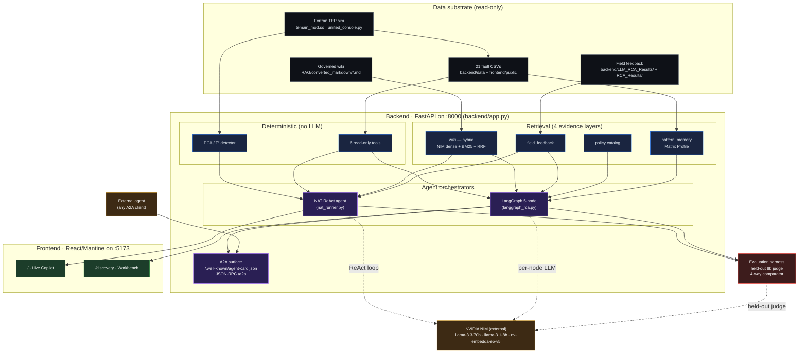

# ⚡ TEP Live Copilot · Agentic Discovery Workbench

> An industrial root-cause-analysis (RCA) prototype on the Tennessee Eastman Process benchmark — a safe surrogate for exploring agentic AI patterns: multi-agent orchestration, hybrid retrieval, time-series memory, A2A inter-agent boundaries, and a held-out evaluation harness.

[](https://github.com/chennanli/Agent_Orchestration_RootCauseAnalysis/actions/workflows/ci.yml)
[](https://github.com/chennanli/Agent_Orchestration_RootCauseAnalysis/actions/workflows/release.yml)


*Real run, captured live: IDV-4 + IDV-6 disturbances injected into the Fortran simulator; PCA T² climbed past threshold; the agent walked through six tool calls in ReAct order; the final advisory called out **XMV_6 (Purge valve)** and **XMEAS_25 (Component C to Reactor)** by tag — no hedge words.*

---

## What this is

A single-page web app that pairs a **live Fortran simulation** of the Tennessee Eastman Process with **two parallel agentic RCA paths** over the same deterministic substrate:

- **Live Copilot** (`/` tab) — a single NVIDIA NeMo Agent Toolkit (NAT) ReAct agent with six read-only tools. The original demo path; preserved end-to-end for honest comparison.
- **Discovery Workbench** (`/discovery` tab) — a 5-node LangGraph state machine (Signal → Evidence → Hypothesis → Evaluator → Human Review) that mixes four parallel evidence layers and is also reachable through an A2A-style JSON-RPC surface.

Both paths share the same deterministic substrate (Fortran sim, PCA/T² detector, 6 read-only tools, governed wiki) and the same held-out evaluation harness. The LLM is only called when the user explicitly initiates a diagnosis or a follow-up question; PCA anomaly detection runs continuously and costs nothing.

> **What this is NOT:** autonomous process control, APC, RTO, or a certified safety system. Read-only tools by construction; every advisory ends with *"requires SME review"*.

---

## Tech stack

Each row is a concrete component wired into the prototype, not a list of words.

| Technology | Role in this project | Code |
|---|---|---|
| **LangGraph** state machine | 5-node bounded orchestrator with critic-as-node + revision loop + HITL gate | `backend/langgraph_rca.py` |
| **LangChain** message types & tool abstractions | Underlying primitives for both LangGraph and the ReAct comparator | `backend/agent_tools/`, `backend/evaluation/evaluate_full.py` |
| **NVIDIA NeMo Agent Toolkit (NAT)** | Baseline ReAct agent with 6 read-only tools — the original single-agent path, kept end-to-end | `backend/nat_runner.py`, `backend/nat_workflows/tep_rca_workflow.yml` |
| **A2A-style JSON-RPC + agent card** | Inter-agent boundary: agent card at `/.well-known/agent-card.json`, `message/send` at `/a2a`, SSE at `/a2a/stream`. LangGraph can optionally delegate wiki retrieval through this boundary | `backend/a2a_router.py`, `docs/A2A_INTEGRATION.md` |
| **ChromaDB + NVIDIA NIM embeddings** (`nv-embedqa-e5-v5`, 1024-d) | Dense vector retrieval over the governed wiki | `backend/agent_tools/vector_knowledge.py` |
| **BM25** (`rank_bm25`) | Sparse keyword retrieval over the same corpus | `backend/agent_tools/vector_knowledge.py` |
| **Reciprocal Rank Fusion (RRF)** | Hybrid retrieval fusing dense + sparse. **Recall@5 = 0.857, MRR = 1.000** on the hand-curated query set | `backend/agent_tools/vector_knowledge.py:hybrid_search` |
| **Matrix Profile** (`stumpy`, AB-join) | Time-series case memory over all 21 fault CSVs; cross-fault-boundary masking; returns top-K analog windows with linked RCA notes | `backend/agent_tools/pattern_tools.py` |
| **Held-out LLM-as-judge** | A smaller different-family model (`meta/llama-3.1-8b-instruct`) grades the grounding of advisories produced by the 70b generator — stricter than same-family self-critique | `backend/evaluation/judge.py` |
| **Synthetic case generator** | LLM-generated diagnostic prompts conditioned on each fault's family + top variables; used to extend the golden set beyond hand-curated cases | `backend/evaluation/synth_cases.py` |
| **4-way comparative harness** | Runs `tools_only` / `nat_react` / `langchain_react` / `langgraph_multi` over the same prompts with the same held-out judge, for apples-to-apples eval | `backend/evaluation/evaluate_full.py` |
| **PCA + Hotelling's T²** detector | Deterministic anomaly detection — pure NumPy, no LLM cost. Arms the diagnose-now flow | `backend/app.py` (continuous), `backend/agent_tools/anomaly_tools.py` (inspect) |
| **FastAPI + Server-Sent Events** | HTTP + SSE backend; per-node state streamed live to the React UI as the LangGraph orchestrator runs | `backend/app.py`, `backend/nat_api_live.py`, `backend/langgraph_api.py` |
| **React + Mantine + Vite** | Two-tab industrial-copilot UI. `/discovery` page renders the live LangGraph pipeline + evidence-by-layer + hypothesis ranking + evaluator verdict | `frontend/src/pages/{LiveCopilotPage,DiscoveryPage}.tsx` |
| **TEP Fortran simulator** (Downs & Vogel 1993, `tep2py`) | 50× real-time chemical-process simulation as the safe industrial surrogate. Compiled `temain_mod.so` shipped in-repo | `backend/simulation/`, `unified_console.py` |
| **NVIDIA NIM** (hosted) | `meta/llama-3.3-70b-instruct` for generation; `meta/llama-3.1-8b-instruct` as the held-out judge; `nv-embedqa-e5-v5` for embeddings. BYOK supported via the UI model dropdown | `backend/agent_models.py`, `backend/multi_llm_client.py` |
| **Docker Compose + GHCR CI/CD** | Three-image build (`backend` / `console` / `frontend`); GitHub Actions publishes to GHCR on every `v*` tag | `Dockerfile.*`, `docker-compose.yml`, `.github/workflows/release.yml` |

---

## Architecture

The deterministic substrate at the bottom, two agent orchestration paths in the middle, two UI tabs at the top, the held-out evaluation harness on the side, and the A2A boundary as a separate external surface.



- **Grey** — deterministic substrate; nothing calls an LLM.
- **Blue** — tools + retrieval. The 4 evidence layers (wiki hybrid, field-feedback, policy catalog, Matrix Profile case memory) are queried in parallel by the LangGraph orchestrator.
- **Violet** — two orchestrators over the same substrate. NAT is a single ReAct agent; LangGraph is a 5-node state machine with a critic-as-node and a bounded revision loop. The A2A surface is a separate JSON-RPC boundary.
- **Green** — UI. Live Copilot consumes NAT; Discovery Workbench consumes LangGraph.
- **Red** — held-out evaluation harness, runs both orchestrators on the same prompts.
- **Amber** — NIM hosts the LLMs; any A2A-speaking agent can call in through the agent card.

A detailed click-flow for one Diagnose-Now interaction lives in [`docs/A2A_INTEGRATION.md`](docs/A2A_INTEGRATION.md) and [`docs/AI_DISCOVERY_BRIEF_AGENTIC_RCA.md`](docs/AI_DISCOVERY_BRIEF_AGENTIC_RCA.md).

---

## Quick start

```bash
git clone https://github.com/chennanli/Agent_Orchestration_RootCauseAnalysis.git
cd Agent_Orchestration_RootCauseAnalysis
echo "NVIDIA_API_KEY=your_key_here" > .env       # or GEMINI_API_KEY=...
docker compose up --build
```

Open <http://localhost:5173/> for the Live Copilot, or <http://localhost:5173/discovery> for the LangGraph Workbench.

Get a free NIM key from [build.nvidia.com](https://build.nvidia.com/) (Llama 3.3 70B + 3.1 8B + Mixtral 8x22B). Gemini works too; paste a key into the in-UI model dropdown — it stays in your browser's `localStorage`, never on the server.

CLI entry points (no UI needed):

```bash
python backend/langgraph_rca.py --fault fault1
python backend/evaluation/evaluate_retrieval.py
python backend/evaluation/evaluate_full.py --limit 5
```

A six-step Docker smoke test (verifies the post-MVP endpoints actually work inside a fresh build) is in [`docs/DOCKER_SMOKE_TEST.md`](docs/DOCKER_SMOKE_TEST.md).

---

## Two agent paths in one repo

| Aspect | Live Copilot (`/`) | Discovery Workbench (`/discovery`) |
|---|---|---|
| Orchestration | Single NAT ReAct agent | LangGraph 5-node state machine |
| Tools / evidence | 6 read-only tools | 4 evidence layers (wiki / field / policy / pattern memory), 6 tools shared |
| Wiki retrieval | Keyword search over markdown | **Hybrid** — NIM dense + BM25 sparse + RRF |
| Termination | Open-ended ReAct loop | Bounded (≤ 3 revisions); explicit HITL gate |
| Evaluator | Policy regex on final draft | Policy regex **+** LLM grounding critic as a graph node |
| External boundary | Internal HTTP only | Also reachable via **A2A** JSON-RPC + agent card |
| UI rendering | Linear `Thought → Action → Observation` trace | 5-step pipeline highlight + evidence-by-layer + hypothesis ranking + evaluator verdict, all over SSE |
| Saved runs | `backend/diagnostics/nat_runs/*.json` | `backend/diagnostics/multi_agent_runs/*.json` |

Both run against the same Fortran sim, the same PCA detector, and the same governed knowledge base — so the comparison is honest.

---

## Tool surface (shared)

Each tool is read-only. Implemented in `backend/agent_tools/`.

| Tool | Purpose | Boundary |
|---|---|---|
| `inspect_anomaly_snapshot` | T² statistic, threshold, row index, fault id | Read-only |
| `rank_contributing_variables` | Process variables most associated with the anomaly | Explains; doesn't prescribe |
| `get_sensor_window` | Short raw-data window for one variable | Inspection only |
| `search_process_knowledge` / hybrid `wiki` retrieval | Search the governed TEP knowledge base | Cites source documents |
| `find_similar_faults` | Match the current signature against the known IDV catalog | Demo similarity, not certified classifier |
| `match_historical_patterns` *(Discovery)* | Matrix Profile analog retrieval over 21 fault CSVs | Reports honest discord when no strong analog exists |
| `check_advisory_policy` | Inspect the final draft for control-style verbs and overclaims | Rejects unsafe phrasing; doesn't certify correctness |

The agent's complete action space. No `set_setpoint`, no `open_valve`, no `start_pump` — *by construction*.

---

## Project layout

```text
backend/
  agent_tools/                 6 deterministic tools + 4-evidence-layer router
    pattern_tools.py             Matrix Profile time-series case memory
    vector_knowledge.py          ChromaDB + BM25 + RRF hybrid retrieval
    evidence_router.py           single entry-point over the 4 evidence layers
    {anomaly,knowledge,history,policy}_tools.py
  nat_workflows/                 NAT ReAct workflow YAML + plugin
  langgraph_rca.py               5-node LangGraph orchestrator (CLI + library)
  langgraph_api.py               POST /api/discovery/diagnose + SSE per-node stream
  a2a_router.py                  A2A agent card + JSON-RPC + SSE + standalone wiki agent
  evaluation/
    evaluate_agentic_discovery.py  NAT baseline vs LangGraph multi-evidence
    evaluate_retrieval.py        keyword / sparse / dense / hybrid head-to-head
    evaluate_full.py             4-way comparator with held-out 8b judge
    judge.py                     held-out grounding judge
    synth_cases.py               synthetic case generator
  app.py                         FastAPI app + /ingest + PCA detector
unified_console.py               Fortran simulator driver on :9002
frontend/src/
  pages/{LiveCopilotPage,DiscoveryPage}.tsx
  components/{DiscoveryGraphPipeline,EvidenceByLayerPanel,HypothesisRanking,
              EvaluatorVerdictPanel,AgentTimelinePanel,FollowupChat,...}.tsx
  hooks/{useAgentStream,useDiscoveryStream,useAnomalyState,useLiveBuffer}.ts
RAG/converted_markdown/*.md      governed wiki corpus (TEP literature)
docs/
  A2A_INTEGRATION.md             A2A surface contract
  AI_DISCOVERY_BRIEF_AGENTIC_RCA.md  research write-up
.github/workflows/{ci,release}.yml   CI on every push, GHCR images on every v* tag
```

---

## What's intentionally NOT in this repo

- Autonomous process control. Every tool is read-only by construction.
- Production-hardened deployment. The A2A surface has no auth or rate limit; default bind is `127.0.0.1`; `TEP_BIND_ALL=1` opts into multi-interface exposure.
- Statistically meaningful benchmarks. Eval scale is 3 discovery cases + 5 full-eval cases — smoke-test scale. The brief is explicit about this.
- Real-process data. TEP is a controlled chemical-process surrogate, not field data.

---

## Documentation

- [`docs/AI_DISCOVERY_BRIEF_AGENTIC_RCA.md`](docs/AI_DISCOVERY_BRIEF_AGENTIC_RCA.md) — research write-up: hypothesis, architecture, evaluation, findings, limitations
- [`docs/A2A_INTEGRATION.md`](docs/A2A_INTEGRATION.md) — A2A surface contract, demonstration commands, honest limits
- [`docs/DOCKER_SMOKE_TEST.md`](docs/DOCKER_SMOKE_TEST.md) — six-step verification that the post-MVP endpoints actually run inside the Docker image
- [`CHANGELOG.md`](CHANGELOG.md) — release notes and **verified metrics per `v*` tag** (recall@5, MRR, grounded_ratio, completion rates)
- Original YouTube walkthrough (fixed-RAG predecessor): <https://www.youtube.com/watch?v=_Sy__E4J0_Q>

---

## Acknowledgements

Built around the [NVIDIA NeMo Agent Toolkit](https://developer.nvidia.com/blog/build-an-agentic-video-workflow-with-video-search-and-summarization/) (`nvidia-nat[langchain]==1.6.0`), [LangGraph](https://github.com/langchain-ai/langgraph), [ChromaDB](https://github.com/chroma-core/chroma), [stumpy](https://github.com/TDAmeritrade/stumpy), and the open Tennessee Eastman Process simulator (Downs & Vogel 1993; Python wrapper [`tep2py`](https://github.com/camaramm/tep2py)).
