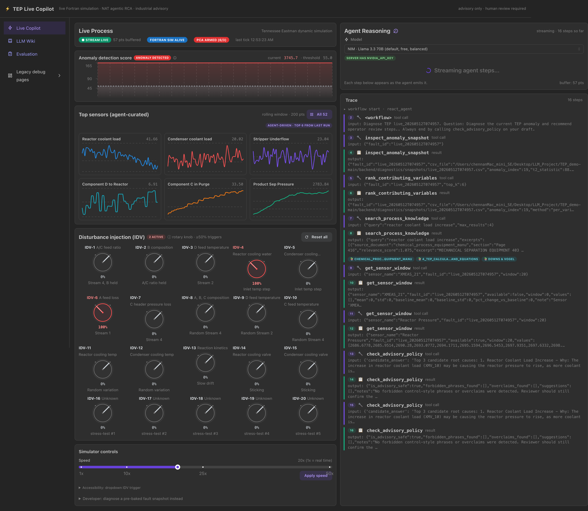
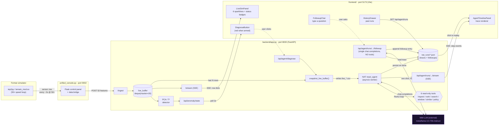
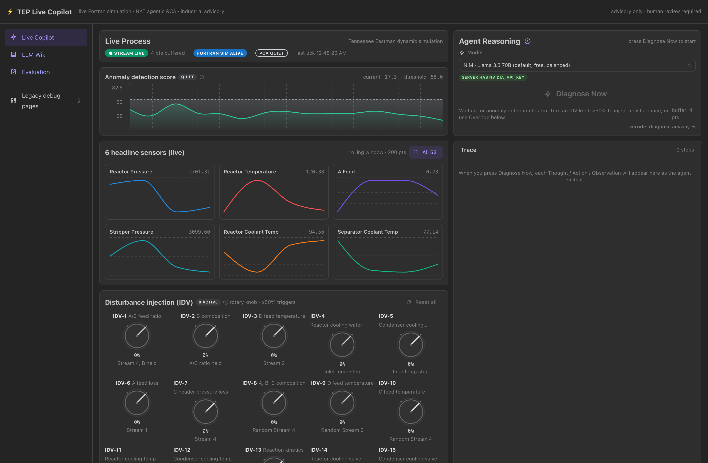
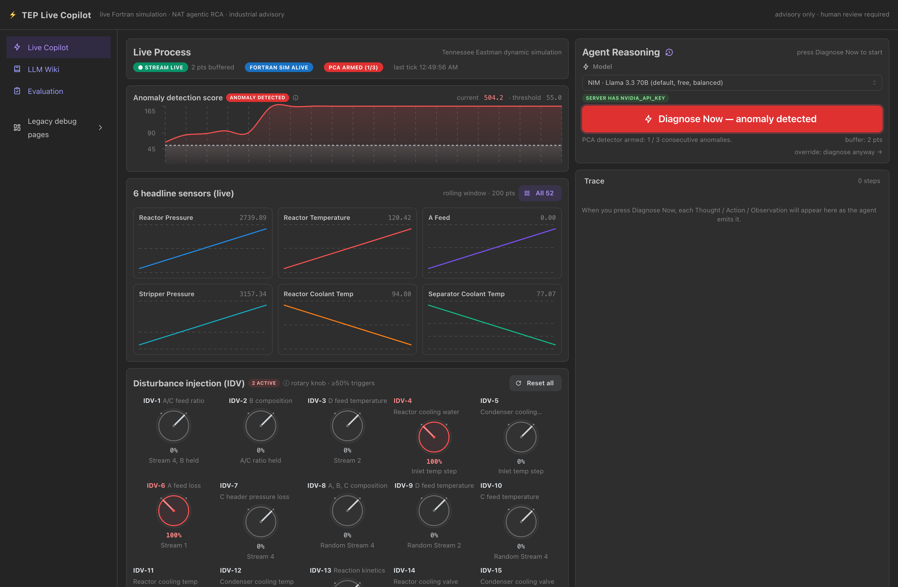
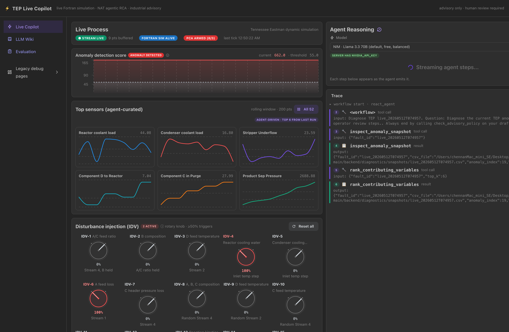

# ⚡ TEP Live Copilot

> Live Fortran simulation of the Tennessee Eastman Process · NVIDIA NeMo Agent Toolkit (NAT) agentic root-cause analysis · industrial-copilot UI that streams the agent's reasoning step by step · advisory only, human review required.

[](https://github.com/chennanli/Agent_Orchestration_RootCauseAnalysis/actions/workflows/ci.yml)
[](https://github.com/chennanli/Agent_Orchestration_RootCauseAnalysis/actions/workflows/release.yml)
     

**Repository:** [github.com/chennanli/Agent_Orchestration_RootCauseAnalysis](https://github.com/chennanli/Agent_Orchestration_RootCauseAnalysis)



*Real run, captured live: IDV-4 + IDV-6 disturbances injected into the Fortran simulator; PCA T² climbed past threshold; the agent walked through six tool calls in ReAct order; the final advisory called out **XMV_6 (Purge valve)** and **XMEAS_25 (Component C to Reactor)** by tag — no hedge words.*

---

## What this is

A single-page web app that pairs a **live Fortran simulation** of the Tennessee Eastman Process with an **agentic root-cause-analysis workflow** built on the NVIDIA NeMo Agent Toolkit (NAT) `react_agent`.

- **Left half of the screen:** the live process — six live sensor sparklines, status badges (stream alive / sim alive / PCA armed), a 1× → 50× speed slider, and an IDV-1..20 fault-trigger dropdown that pokes the Fortran sim.
- **Right half of the screen:** the agent — one big **Diagnose Now** button. Press it and the agent's thought / action / observation steps stream into the panel one by one over SSE. At the bottom: the final advisory, a policy-safety badge, citations into the local TEP knowledge base, and a follow-up chat box you can use to ask one-shot questions about the saved run without re-running the agent.

The agent only calls the LLM when you press the button. The PCA detector runs continuously in the background — it's pure NumPy and costs nothing — and just **arms** the button when it sees an anomaly. Past runs are stored as flat JSON files; click **History** to replay any of them read-only and ask follow-ups.

> **It is not** autonomous process control, APC, RTO, or a certified safety system.

---

## What changed from the original demo

The very first version of this project, recorded on YouTube here ▶ **[original walkthrough](https://www.youtube.com/watch?v=_Sy__E4J0_Q)**, was a fixed RAG + multi-LLM RCA pipeline. The codebase has since been **rebuilt around an agentic NAT workflow** and a new UI. Both paths still ship in the repo so the comparison is honest:

| | Original (YouTube video) | New (this README) |
|---|---|---|
| **How the LLM is invoked** | Every detected anomaly fires an LLM call. The LLM only sees a flat prompt — top features + descriptions. | **Only when the user presses Diagnose Now.** The LLM is given six **tools** (inspect snapshot, rank variables, search the wiki, look up similar faults, query a sensor window, policy-check its own draft) and decides which to call in a ReAct loop. |
| **Reasoning visibility** | Final answer only, no trace. | Every `Thought → Action → Observation` step streams to the UI as it happens. |
| **Where the data comes from** | Same Fortran sim. | Same Fortran sim — but on **Diagnose Now** the live buffer is **frozen** into a 107-column snapshot CSV, so the agent reasons over a reproducible, replayable view, not a moving target. |
| **Cost / safety** | LLM called on every anomaly → easy to burn through tokens; multiple providers in parallel for comparison. | One agent run per click. Past runs stored locally; follow-up chat against a saved run is a single LLM call, not a ReAct loop. Built-in advisory-policy checker blocks control-style wording. |
| **UI shell** | Multi-page Flask + early React. | Single page Mantine-based "industrial copilot" split layout, dark theme, monospace trace, SSE streaming. |
| **Evaluation** | Manual visual inspection of LLM answers. | 7-case golden-case harness ([`backend/evaluation/`](backend/evaluation/)) with hard contracts: `tool_availability=1.0`, `policy_check≥0.9`, `trajectory_available≥0.5`. |

**Both paths still exist in the repo.** The original Flask multi-LLM control panel is `unified_console.py` and runs on port 9002. The new React UI is the default page on port 5173. They share the same FastAPI backend on port 8000.

---

## Architecture

### End-to-end data + agent flow



**Key design choices** (none of these were free):

1. **Snapshot-on-click, not stream-into-agent.** When you press Diagnose Now, the current contents of `live_buffer` (a rolling window, default `pca_window_size = 20` rows) are frozen into a 107-column CSV under `backend/diagnostics/snapshots/live_<ts>.csv` — the same schema as the seeded `fault*.csv` files. The agent's six tools don't even *know* whether they're reading a pre-baked fault or a live snapshot. This kept the eval harness and the tools unchanged across the live-mode upgrade.
2. **SSE thread-to-loop hop.** NAT's `run_nat` is synchronous and runs inside `asyncio.to_thread`. Each `IntermediateStep` from `runner.context.intermediate_step_manager.subscribe()` is delivered to the FastAPI event loop via `loop.call_soon_threadsafe(queue.put_nowait, ...)`, and the SSE generator awaits the queue. See [`backend/nat_api_live.py`](backend/nat_api_live.py).
3. **No always-on LLM.** PCA runs continuously, pure NumPy — anomaly detection costs nothing. The LLM (NVIDIA NIM `meta/llama-3.3-70b-instruct`) is only invoked when the user presses **Diagnose Now** (one ReAct loop with tool calls) or types a **Follow-up** (one direct `chat.completions.create` with the saved trace as context, **no tools**, no ReAct). Follow-ups are the cheap path; they re-use the existing run snapshot and just ask one more question.
4. **Module-resolution trick.** Because `backend/app.py` is run as `__main__`, the live-routes module would otherwise load a second copy. [`_resolve_app_module()`](backend/nat_api_live.py) prefers `sys.modules['__main__']` so the `live_buffer` it reads is the one `/ingest` is writing to.

### Backend surface

| Route | What it does |
|---|---|
| `POST /ingest` | Existing — accepts one 52-feature sensor row from `unified_console.py`. |
| `GET /stream` | Existing SSE — streams live data points to the old UI. |
| `POST /api/agent/diagnose` | **New.** Snapshots the live buffer (or accepts a `fault_id`), spawns NAT, returns a `run_id` immediately. |
| `GET /api/agent/runs/{id}/stream` | **New.** SSE — emits one `event: step` per `IntermediateStep`, one final `event: done` with the full payload. Replays from disk if the run already finished. |
| `GET /api/agent/runs` | **New.** Lists past runs (summary). |
| `GET /api/agent/runs/{id}` | **New.** Full saved run JSON. |
| `POST /api/agent/runs/{id}/followup` | **New.** Single-shot LLM call given the saved trace as context; appends to `run.followups[]` in the JSON. |
| `GET /api/anomaly/state` | **New.** Read-only view of the PCA detector: `{armed, consecutive_anomalies, threshold, buffer_len}`. |
| `GET/POST /api/sim/{status,speed,fault}` | **New.** HTTP-proxy routes to `unified_console.py` on port 9002 — speed slider + IDV trigger. |

### Frontend layout

```
┌─────────────────────────────────────────────────────────────────────┐
│  ⚡ TEP Live Copilot                            advisory only · ... │
├────────────────────┬────────────────────────────────────────────────┤
│                    │                                                │
│  Live Process      │  Agent Reasoning  [📜 history]                │
│  ● stream live     │  ┌────────────────────────────────────────┐   │
│  ● fortran alive   │  │ ⚡ Diagnose Now  (red glow if armed)   │   │
│  PCA quiet         │  └────────────────────────────────────────┘   │
│                    │                                                │
│  ┌──┐ ┌──┐ ┌──┐    │  Trace                                         │
│  └──┘ └──┘ └──┘    │  🔧 inspect_anomaly_snapshot                  │
│  ┌──┐ ┌──┐ ┌──┐    │     output: T²=174.2, idx=45, fault1.csv      │
│  └──┘ └──┘ └──┘    │  🔧 rank_contributing_variables                │
│                    │     output: A feed load, Component C, ...     │
│  Speed [==•=] 20×  │  🔧 search_process_knowledge                   │
│  IDV: [None ▾]     │     output: 📚 1_TEP_Control_Structure ...    │
│                    │  ✅ Final advisory  [policy safe]              │
│  (fault snapshot)  │                                                │
│  [fault1 ▾]        │  💬 Follow-up chat (single LLM call each)     │
└────────────────────┴────────────────────────────────────────────────┘
```

The component tree is in [`frontend/src/`](frontend/src/) — page, 8 components, 3 hooks, one typed API client.

---

## Run it

### Quick start with Docker (recommended for first-time users)

Cross-platform, no Python/Node/Fortran toolchain needed. Runs the same images that get built and published on every release.

```bash
# 1. Clone
git clone https://github.com/chennanli/Agent_Orchestration_RootCauseAnalysis.git
cd Agent_Orchestration_RootCauseAnalysis

# 2. Put your API key in .env (NVIDIA NIM is free, Gemini is free; either works)
echo "NVIDIA_API_KEY=your_key_here" > .env
#   (or)
echo "GEMINI_API_KEY=your_key_here" > .env

# 3. Pull the pre-built images and run
docker compose pull
docker compose up
```

Open <http://localhost:5173/> — full Live Copilot UI, ready to take a `Diagnose Now` click.

To stop everything: `docker compose down`. To rebuild from source instead of pulling: `docker compose up --build`.

#### Get an API key (free)

| Provider | Tier | Sign-up |
|---|---|---|
| **NVIDIA NIM** | Free for personal use, includes Llama 3.3 70B / 3.1 8B / Mixtral 8x22B | <https://build.nvidia.com/> → Get API Key |
| **Google Gemini** | Free tier, includes Gemini 2.5 Flash & Pro | <https://aistudio.google.com/app/apikey> |

You can also paste your key directly into the **Model** dropdown in the UI — it stays in your browser's `localStorage` and never touches the server.

#### Published images

Built by [`.github/workflows/release.yml`](.github/workflows/release.yml) on every `v*` git tag, pushed to GHCR:

```text
ghcr.io/chennanli/agent_orchestration_rootcauseanalysis/backend:<tag>
ghcr.io/chennanli/agent_orchestration_rootcauseanalysis/console:<tag>
ghcr.io/chennanli/agent_orchestration_rootcauseanalysis/frontend:<tag>
```

Set `COMPOSE_IMAGE_TAG=v0.3.0` in `.env` to pin to a specific release; otherwise `:latest` follows main.

---

### Easiest — one click on macOS

Double-click [`START_TEP_COPILOT.command`](START_TEP_COPILOT.command) from Finder, or from a terminal:

```bash
./START_TEP_COPILOT.command
```

It starts **all three** services, hits `POST /api/ultra_start` to spin the Fortran sim up at 50×, and opens `http://localhost:5173/` in your browser. Logs land in `/tmp/tep_*.log`.

To stop: double-click [`STOP_TEP_COPILOT.command`](STOP_TEP_COPILOT.command), or:

```bash
pkill -f 'backend/app.py' ; pkill -f unified_console.py ; pkill -f vite
```

### Manual three-terminal start

```bash
# Terminal A — backend (port 8000)
.venv/bin/python backend/app.py

# Terminal B — Fortran sim driver (port 9002). Optional — skip if you only want
# to run NAT against pre-baked fault CSVs.
.venv/bin/python unified_console.py
curl -X POST http://localhost:9002/api/ultra_start \
  -H 'content-type: application/json' -d '{}'

# Terminal C — frontend (port 5173)
cd frontend && npm run dev

open http://localhost:5173/
```

### How to actually demo this (the intended narrative)

The Live Copilot is built around a deliberate sequence — *not* "press the button whenever". Walk through these steps in order:

1. **Open `http://localhost:5173/`.** Status strip is green: `● STREAM LIVE`, `FORTRAN SIM ALIVE`, `PCA QUIET`. The anomaly detection chart hovers near baseline, well under the dashed threshold. Six sparklines are drawing real Fortran-generated sensor curves. The Diagnose Now button is **disabled** and tells you why: *"Waiting for anomaly detection to arm. Turn an IDV knob ≥50%..."*.
2. **Turn an IDV knob.** Scroll to the **Disturbance injection (IDV)** panel. Each of the 20 dials is one TEP fault category (Downs & Vogel 1993 standard). Click-and-drag a knob clockwise: at ≥ 50% the dial turns red and the fault is injected into the running Fortran sim. You can stack multiple simultaneously (compound faults). Good starter combo: `IDV-4 (Reactor cooling water)` + `IDV-6 (A feed loss)`, both at 100%.
3. **Watch the score climb.** Within ~10 seconds the anomaly detection chart turns red and crosses the threshold. The `ANOMALY DETECTED` badge appears. The Diagnose Now button switches to red with *"anomaly detected"*.
4. **Pick a model (optional).** Above the Diagnose Now button is a model dropdown — default is NIM Llama 3.3 70B (free). Other options as of 2026-05: Llama 3.1 8B (free fast fallback), Mixtral 8x22B (free, mixture-of-experts), Gemini 2.5 Flash (free), Gemini 2.5 Pro (paid). The canonical list lives in [`backend/agent_models.py`](backend/agent_models.py). For Gemini you'll need a Google API key (free tier from [aistudio.google.com](https://aistudio.google.com/app/apikey)) — paste it in the masked field, click Save. The key is stored only in your browser's localStorage.
5. **Click Diagnose Now.** The right panel shows `Streaming agent steps…`. Each Thought / Action / Observation appears over SSE. The left panel's sparkline grid auto-swaps to the agent's top-6 most-affected sensors mid-run. Press **All 52** if you want the full DCS view.
6. **Read the structured advisory.** It will name specific XMV_X / XMEAS_Y tags. On Gemini 2.5 (Flash or Pro), the output will be a structured *Top 3 candidate root causes / Most likely / Operator next steps* breakdown (the system prompt asks for that format; smaller models like Llama 70B may give a shorter version).
7. **Ask a follow-up.** Bottom of the right panel: chat box. Type *"Why did you rule out the stripper steam valve?"* or *"How would XMV_10 saturation explain this?"*. Single LLM call (no tools), cheap, persisted in the same run JSON.
8. **Browse past runs.** Click the 🕐 history icon next to "Agent Reasoning". Drawer slides in with every prior run. Click one → loads read-only with its follow-up history restored.
9. **Clear faults.** Click **Reset all** in the IDV panel — every red dial drops back to 0%, disturbances release, anomaly score relaxes, button disables again. Back to step 1.

### Is the agent limited to 20 fault categories?

**No.** The "20 IDVs" are the TEP benchmark's named disturbance categories (Downs & Vogel 1993). The actual demo space is much wider:

- **Compound faults.** Multiple IDV knobs at 100% simultaneously produces sensor responses that no single IDV does. The agent reasons over the combined symptom set.
- **Intensities.** The wire-level protocol is 0/1, but the rotary knob UI invites you to think of the disturbance as a continuous knob. We map ≥ 50% → 1, < 50% → 0 (TEP's underlying flag is binary; partial-magnitude faults would require modifying the Fortran wrapper).
- **Manual valve overrides.** TEP has 11 manipulated variables (XMV_1..XMV_11). The current UI does not expose those as knobs — but the simulator accepts them. Adding XMV setpoint sliders is straightforward future work.

The `frontend/public/fault*.csv` files are **recorded sample runs** of single-IDV scenarios at fixed intensity — kept for offline testing and the golden-case eval harness. They're hidden behind a `Developer: diagnose a pre-baked fault snapshot` collapsed section so they don't compete with the live-trigger flow.

### Quick check: healthy vs offline UI

| Healthy | Offline (sim not running) |
|---|---|
| `● stream live` `fortran sim alive` | `● no stream` `fortran sim offline` |
| Buffer count climbs every ~2s | Buffer count stays at 0 |
| PCA score chart drawing real T² | Empty — `waiting for buffer to fill...` |
| Sparklines start drawing within 10s | Cards show `░░░░ no data ░░░░` |
| IDV trigger dropdown enabled | Disabled — start `unified_console.py` first |
| Live mode requires arming via IDV trigger | Pick a pre-baked fault from the dropdown (fault0…14) and diagnose that — bypasses arming |

### Troubleshooting

| Symptom | Likely cause | Fix |
|---|---|---|
| `fortran sim offline` after launch | `unified_console.py` failed to import or to bind 9002 | `tail /tmp/tep_unified.log` — most often a missing dep (`flask_cors`) or port conflict. The launcher tells you which. |
| Browser opens on `:5174` instead of `:5173` | A stray `vite` is still on 5173 | `pkill -f vite ; sleep 2 ; cd frontend && npm run dev` |
| `POST /api/agent/diagnose` returns 409 `no live data` | Buffer is empty (just started, or sim not pushing) | Wait 10 s, or pick a pre-baked fault from the dropdown in the left panel |
| Agent fails all cases in <5 s each with `LLM output: ''` | NIM free-tier rate limit | Wait a few minutes, or swap `meta/llama-3.3-70b-instruct` → `meta/llama-3.1-8b-instruct` in [`backend/nat_workflows/tep_rca_workflow.yml`](backend/nat_workflows/tep_rca_workflow.yml). |
| `google.genai` import error | Optional Gemini SDK missing | Already worked around in [`backend/multi_llm_client.py`](backend/multi_llm_client.py). |

### Model selection (in-UI)

The "Model" dropdown above Diagnose Now lets you pick the LLM for the next run. Defaults to a free NIM model; stronger / different providers available without restarting anything.

| Model id | Provider | API key needed | Notes |
|---|---|---|---|
| `nim-llama-3.3-70b` (default) | NVIDIA NIM | `NVIDIA_API_KEY` | Free tier, balanced, fastest |
| `nim-llama-3.1-8b` | NVIDIA NIM | `NVIDIA_API_KEY` | Free, very fast fallback when 70B is rate-limited |
| `nim-mixtral-8x22b` | NVIDIA NIM | `NVIDIA_API_KEY` | Free, Mistral mixture-of-experts |
| `gemini-2.5-flash` | Google | `GEMINI_API_KEY` | Free tier, current stable Flash |
| `gemini-2.5-pro` | Google | `GEMINI_API_KEY` | Best for the structured Top-3-root-causes output |

> Model availability moves fast. As of 2026-05, **Llama 3.1 405B is EOL** on NIM (`410 Gone` since 2026-04-21) and `gemini-1.5-flash` / `gemini-2.0-flash` / `nvidia/llama-3.1-nemotron-70b-instruct` all returned 404 — they're not in the dropdown. If you see "model not found" errors after a few months, the model has likely been retired; add a replacement in [`backend/agent_models.py`](backend/agent_models.py).

If the server's `.env` has the corresponding API key, the model is ready to go. If not, the dropdown shows a masked password input — paste your own key, click Save, run. The key persists in `localStorage` only on this device; the server never writes it to disk.

Each run records which model it used in the saved run JSON (`backend/diagnostics/nat_runs/<run_id>.json` field `model_id`). You can compare two runs of the same fault side-by-side by switching models and re-pressing Diagnose Now.

### One-command backend smoke (no UI needed)

```bash
scripts/smoke_live_copilot.sh
```

Boots the backend, kicks off a diagnose against pre-baked `fault4`, tails the SSE stream until `event: done`, then sends a follow-up. Exits 0 on success.

---

## Screenshots — the actual demo narrative

The intended flow is **turn an IDV knob ≥50% → watch the spike → diagnose**. The Diagnose Now button is **disabled** by default; it only enables once anomaly detection arms (or you click *override*).

### 1. Idle — sim running quietly, all 20 IDV knobs at 0%



Status strip is green (`stream live`, `fortran sim alive`, `pca quiet`). The **Anomaly detection score** chart is bounded — the dashed threshold line is always visible at ~2/3 height so you can see how close to alarm you are. The bottom panel is the **rotary IDV knob grid**: 20 dials, one per Tennessee Eastman disturbance. The Diagnose Now button is gray and explains "*Waiting for anomaly detection to arm. Turn an IDV knob ≥50% to inject a disturbance.*"

### 2. Anomaly detected — IDV-4 + IDV-6 turned to 100%, score crosses threshold



I turned the **IDV-4 (Reactor cooling water)** knob and the **IDV-6 (A feed loss)** knob to 100% — both visibly red. Within ~10 seconds the anomaly score chart turns red and crosses the threshold. The `ANOMALY DETECTED` badge appears. The Diagnose Now button is now red with the label *"anomaly detected"*. The **LLM has not been called once** so far — PCA detection is pure NumPy, costs nothing.

### 3. Pressing Diagnose Now — trace streams in step by step



Each `Thought → Action → Observation` step appears as the NAT agent emits it, streamed over SSE from `/api/agent/runs/{id}/stream`. As soon as the agent's `rank_contributing_variables` call returns, the left panel's sparkline grid **auto-swaps** from the default 6 headline sensors to the agent-curated top 6 — so the operator sees exactly the sensors the agent thinks matter for *this* fault. Press **All 52** to see the full DCS view.

### 4. Done — full trace, XMV/XMEAS-specific advisory, follow-up chat


Six tool calls in ReAct order: `inspect_anomaly_snapshot → rank_contributing_variables → search_process_knowledge → get_sensor_window (×N) → find_similar_faults → check_advisory_policy`. The Final advisory at the bottom is **specific** — it names XMV_6 (Purge valve) and XMEAS_25 (Component C to Reactor) by tag, not "may be related to a cooling issue". Output detail depends on the model: Llama 3.3 70B (default) gives 2-3 sentences; switch to **Gemini 2.5 Flash or Pro** in the Model dropdown for Top-3-candidate-causes structured output with "Features explained: X of 6" per cause. Below it: the **Follow-up chat** lets you ask one-shot questions without re-running the agent (single `chat.completions.create`, no ReAct loop, cheap). Follow-up now also respects the selected model — if you switch from Llama 70B to Gemini 2.5 Pro between question and follow-up, the follow-up will go to Gemini.

---

## Tool surface

Each tool is read-only. Listed in `backend/nat_workflows/tep_rca_workflow.yml`, implemented in `backend/agent_tools/`.

| Tool | Purpose | Boundary |
|---|---|---|
| `inspect_anomaly_snapshot` | Read the fault event: T² statistic, threshold, row index, fault id. | Read-only. |
| `rank_contributing_variables` | Rank the process variables most associated with the anomaly. | Explains evidence; does not prescribe action. |
| `get_sensor_window` | Return a short raw-data window for one variable. | Inspection only. |
| `search_process_knowledge` | Keyword search over local TEP markdown docs; returns source-cited excerpts. | Keyword, not vector search. |
| `find_similar_faults` | Compare the current signature with known fault descriptions and prior reports. | Demo similarity, not a certified classifier. |
| `check_advisory_policy` | Inspect the final draft for control-style language and overclaims. | Blocks unsafe wording; does not certify correctness. |

The full set is the agent's complete action space. No `set_setpoint`, no `open_valve`, no `start_pump` — *by construction*. The policy checker rejects the answer if the LLM ever phrases its advisory as a command.

---

## Verified status

Last verified locally on 2026-05-11 with NAT 1.6.0 (`meta/llama-3.3-70b-instruct`):

| Check | Result | Hard threshold |
|---|---|---|
| Backend Python compile | ✓ | — |
| Frontend production build (`npm run build`) | ✓ | — |
| Tools-only runner, `fault1` + `fault4` | ✓ | — |
| Real NAT agent runner, 7 golden cases | 7 / 7 produced a trajectory | — |
| `tool_availability_pass_rate` | **1.0** | ≥ 1.0 |
| `policy_check_pass_rate` | **1.0** | ≥ 0.9 |
| `trajectory_available_rate` | **0.71-1.0** (LLM-nondeterministic) | ≥ 0.5 |
| `required_tools_hit_rate` | 0.57-0.86 (LLM-nondeterministic) | — |
| `source_citation_present_rate` | 0.71-0.86 | > 0 |
| `forbidden_phrase_total` | **0** | 0 |
| `avg_latency_seconds` | 27-70 | 5-60 band |
| Live snapshot → NAT (port 8000 only) | ✓ (`backend/diagnostics/snapshots/live_*.csv`) | — |
| Live sim → backend → snapshot → agent (full path) | ✓ end-to-end | — |

Remaining boundary: this is a benchmark portfolio demo; not a production APC / RTO / certified safety system. Human review required.

---

## Project layout

```text
backend/
  agent_tools/            6 read-only tools the agent can call
    live_snapshot.py        freezes live_buffer to a 107-col CSV
    anomaly_tools.py        inspect / rank / window  (live_* dispatch in _resolve_csv_path)
    knowledge_tools.py      search_process_knowledge
    history_tools.py        find_similar_faults
    policy_tools.py         check_advisory_policy
  nat_workflows/
    tep_rca_workflow.yml    react_agent + nim LLM + 6 tools
    nat_tep_plugin.py       NAT tool registrations
  evaluation/
    golden_cases.jsonl      7 must-pass cases
    evaluate_nat_rca.py     harness (--tools-only or --run-agent)
  diagnostics/
    nat_runs/               one JSON per run, including streamed trace + followups
    snapshots/              one live_<ts>.csv per Diagnose Now click
  nat_runner.py             entry point — also exposes run_nat_streaming for SSE
  nat_api.py + nat_api_live.py  FastAPI routers
  sim_control.py            /api/sim/* proxy to unified_console.py
  app.py                    FastAPI app + /ingest + /stream + PCA detector
unified_console.py          legacy Flask UI on :9002 — owns the Fortran sim
frontend/
  src/
    pages/LiveCopilotPage.tsx        the new home
    pages/LLMWikiPage.tsx            wiki, accepts ?doc= deep-links
    components/{LiveSimPanel,AgentTimelinePanel,DiagnoseButton,
                TraceStep,SensorSparklineGrid,StatusBar,SimControls,
                FollowupChat,HistoryDrawer}.tsx
    hooks/{useAnomalyState,useLiveBuffer,useAgentStream}.ts
    api/agent.ts                     typed fetch helpers
  public/fault*.csv                  7 pre-baked fault snapshots
docs/
  superpowers/specs/  · plans/       full design + implementation plans
  assets/                            screenshots referenced above
scripts/
  smoke_live_copilot.sh              full backend smoke
  test_nat_real.sh                   one-shot NAT verification
START_TEP_COPILOT.command            double-click launcher (macOS)
STOP_TEP_COPILOT.command             companion stop script
```

---

## Acknowledgements & history

The very first version of this project, recorded for YouTube here ▶ **[original walkthrough](https://www.youtube.com/watch?v=_Sy__E4J0_Q)**, was a Flask + multi-LLM RCA control panel. It still lives in this repo as `unified_console.py` (port 9002) and the `/legacy/*` React routes, kept intact so the comparison is honest.

Built around the [NVIDIA NeMo Agent Toolkit](https://developer.nvidia.com/blog/build-an-agentic-video-workflow-with-video-search-and-summarization/) (`nvidia-nat[langchain]==1.6.0`) and the open Tennessee Eastman Process simulator (Downs & Vogel 1993, Python wrapper `tep2py`).

This README, the architecture, and every commit in this repository are written and maintained by **chennanli**.
